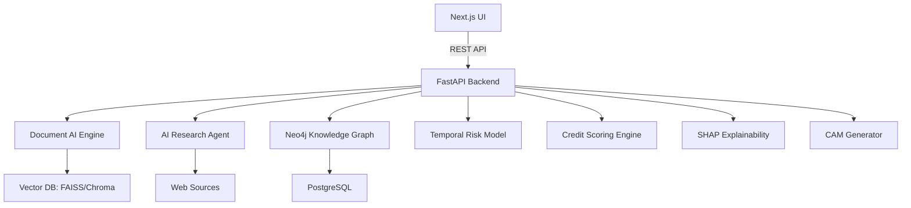

# CREDITINTEL AI – Autonomous Corporate Credit Intelligence Engine

A production-ready hackathon prototype for automated corporate credit analysis and CAM generation. The system ingests financial documents, extracts structured metrics, performs automated research, builds a corporate knowledge graph, predicts creditworthiness, explains the decision, and generates a Credit Appraisal Memo (CAM).

## System Architecture



## Local Development

### Backend

```bash
cd backend
python -m venv .venv
source .venv/bin/activate
pip install -r requirements.txt
uvicorn backend.main:app --reload
```

### Frontend

```bash
cd frontend
npm install
npm run dev
```

## Deployment

### Backend → Render

1. Create a new Render **Web Service** from this repo.
2. Root directory: `backend`
3. Build command: `pip install -r requirements.txt`
4. Start command: `uvicorn backend.main:app --host 0.0.0.0 --port 8000`
5. Set environment variables (see `backend/.env.example`).

### Frontend → Vercel

1. Import repo in Vercel.
2. Root directory: `frontend`
3. Framework: Next.js
4. Set `NEXT_PUBLIC_API_URL` to your Render URL.

## API Design

- `POST /upload-documents`
- `POST /analyze-company`
- `GET /risk-score?company_id=...`
- `GET /explanations?company_id=...`
- `GET /generate-cam?company_id=...`

## Demo Walkthrough

1. **Upload documents** from the Upload page.
2. **Run analysis** from the Company page (mocked in prototype).
3. **Review risk signals** and SHAP explanations in the Risk page.
4. **Open CAM** to view summary and export PDF.
5. **Dashboard** shows portfolio KPIs and early warning signals.

## Project Structure

```
/backend
  /agents
  /models
  /document_ai
  /research
  /risk_engine
  /cam_generator
  /graph
  /vector_db
  main.py
/frontend
  /pages
  /components
  /dashboard
  /charts
```

## Notes

- `USE_MOCK_MODELS=true` runs a full demo without heavyweight ML dependencies.
- Replace placeholders with real models: LayoutLMv3, Donut, Patram-7B, SHAP, Neo4j, FAISS.
